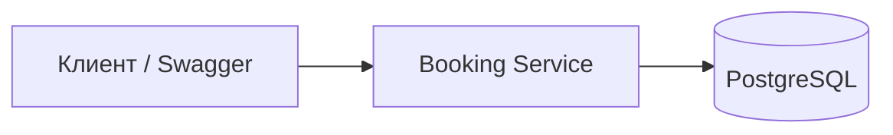
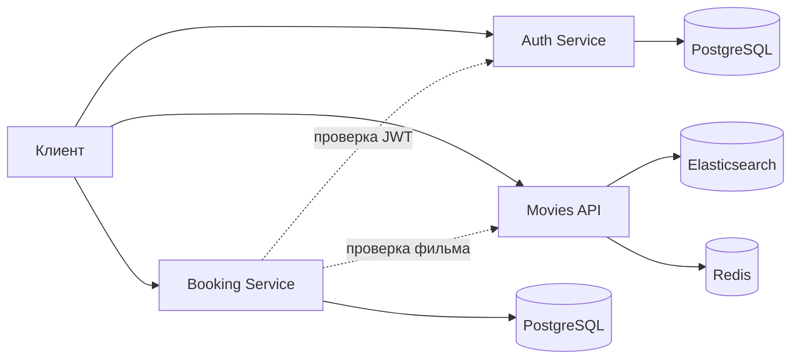

# Архитектура дипломного проекта

## Архитектура MVP

## Архитектура в общем контуре онлайн-кинотеатра

## Компоненты

### Booking Service

Новый дипломный сервис. Отвечает за события совместных просмотров и бронирования мест.

### PostgreSQL

Основное хранилище сервиса бронирования. Хранит события и бронирования.

### Auth Service

Внешняя зависимость общего контура онлайн-кинотеатра. В MVP booking_service проверяет JWT по секрету из переменных окружения.

### Movies API

Внешняя зависимость общего контура онлайн-кинотеатра. В MVP booking_service хранит `movie_id`, а проверка фильма может быть включена через `MOVIES_API_VALIDATE=true`.

## Главный технический риск

Основной риск — конкурентное бронирование последнего места несколькими пользователями одновременно.

Решение:

1. открыть транзакцию;
2. заблокировать строку события через `SELECT ... FOR UPDATE`;
3. посчитать активные бронирования;
4. если мест нет — вернуть 409;
5. если место есть — создать бронь;
6. завершить транзакцию.